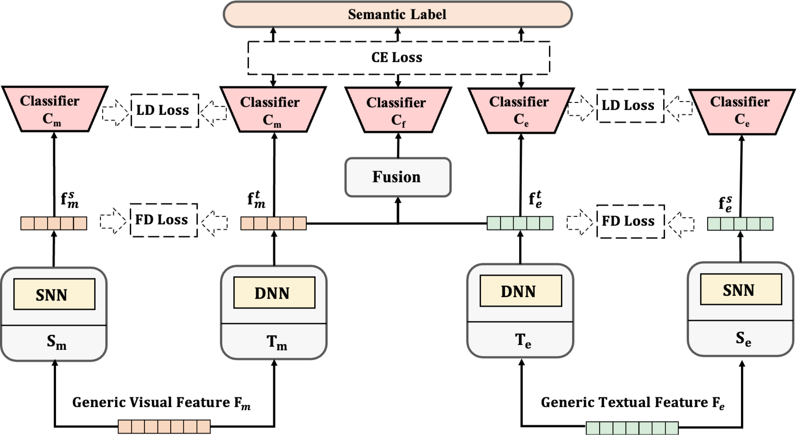
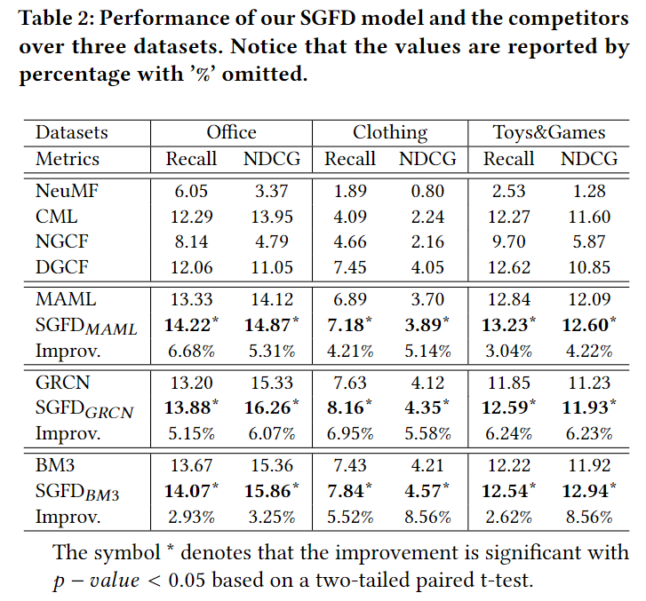

# Semantic-Guided Feature Distillation for Multimodal Recommendation
This is our Pytorch implementation for the paper:  
> Fan Liu, Huilin Chen, Zhiyong Cheng, Liqiang Nie, Mohan Kankanhalli. Semantic-Guided Feature Distillation for Multimodal Recommendation. In ACM MM`23 
Author: Dr. Fan Liu (liufancs@gmail.com)

## Introduction
In this work, we propose a novel model-agnostic approach, named Semantic-Guided Feature Distillation (SGFD), which can robustly extract effective recommendation-oriented modality features from generic modality features for recommendation. The SGFD model employs a teacher-student framework to extract features for multimodal recommendation. The teacher model first extracts rich modality features from the generic modality features by considering both the semantic information of items and the complementary information of multiple modalities. It then utilizes response-based and feature-based distillation loss to effectively transfer the knowledge encoded in the teacher model to the student model.
## Overview of SGFD

## Environment Requirement
For GRCN and BM3 model 
- Pytorch == 1.13.0
- torch-cluster == 1.6.1
- torch-geometric == 2.3.1
- torch-scatter == 2.1.1
- torch-sparse == 0.6.17

For MAML model
- Tensorflow-gpu version: 1.3.0

## Dataset
We provide three processed datasets: Office, Clothing and Toys Games. Besides, we also share our training dataset [Google Ddrive](https://drive.google.com/drive/folders/1kGsm9RaUnhn3ujJoEi3MIZQofHb5XRmt?usp=sharing) with public researchers.

|            | #Interactions | #Users | #Items | #Label | Sparsity |
|:-----------|:--------------|:-------|:-------|:-------|:---------|
| Office     | 52,957        | 4,874  | 7,279  | 54     | 99.85%   |
| Clothing   | 150,889       | 18,209 | 17,318 | 26     | 99.98%   |
| Toys Games | 161,653       | 18,748 | 11,672 | 19     | 99.97%   |

### Item Feature Files

- `MetaData_normal.npy` Item Category Label. 
- `FeatureImage_normal.npy` Image features.
- `FeatureText_normal.npy` Text features.

### User-Item Interaction Files:

- `train.csv`
   Train file. Each line is a user with her/his positive interactions with items: (userID and itemID)   
- `test.csv`
   Test file. Each line is a user with her/his several positive interactions with items: (userID and itemID)  

## Example to Run the Codes
To report the performance of SGFD, we implement our work into three multimodal recommendation
models, which equipped with our proposed method.

### Run BM3 model:

The instruction of commands has been clearly stated in the codes.
- Office dataset  
`cd BM3 && python main.py -m BM3 -d Office --gpu 0 --l_r 1e-1 --ce_weight=1e-1  --kd_weight=1e-2  --t_decay=50`
- Clothing dataset  
`cd BM3 && python main.py -m BM3 -d Clothing --gpu 0 --l_r 1e-2 --ce_weight=1e-2  --kd_weight=1e-1  --t_decay=100`
- Toys Games dataset  
`cd BM3 && python main.py -m BM3 -d ToysGames --gpu 0 --l_r 1e-2 --ce_weight=1e-1  --kd_weight=1e-2  --t_decay=5`

More important arguments described in [BM3 Model](https://github.com/enoche/BM3)

### Run GRCN model:

The instruction of commands has been clearly stated in the codes.
- Office dataset  
`cd GRCN && python -u main.py --l_r=0.001 --weight_decay=0.001 --data_path=Office  --topK=20 --ce_weight=1e-0  --kd_weight=1e-0 --t_decay=100`
- Clothing dataset  
`cd GRCN && python -u main.py --l_r=0.0001 --weight_decay=0.001 --data_path=Clothing  --topK=20 --ce_weight=1e-2  --kd_weight=1e-2 --t_decay=100`
- Toys Games dataset  
`cd GRCN && python -u main.py --l_r=0.0001 --weight_decay=0.001 --data_path=ToysGames  --topK=20 --ce_weight=1e-1  --kd_weight=1e-0 --t_decay=10`  

More important arguments described in [GRCN Model](https://github.com/weiyinwei/GRCN). 

### Run MAML model:

The instruction of commands has been clearly stated in the codes.
- Office dataset  
` cd MAML && python MAML.py --dataset Office --ce_weight=1e-0 --kd_weight=1e-1  --gpu 0`
- Clothing dataset  
` cd MAML && python MAML.py --dataset Clothing --ce_weight=1e-1 --kd_weight=1e-1  --gpu 0`
- Toys Games dataset  
` cd MAML && python MAML.py --dataset ToysGames --ce_weight=1e-2 --kd_weight=1e-1  --gpu 0`

More important arguments described in [MAML Model](https://github.com/liufancs/MAML)

## Results:

Compare with vanilla methods, we can see that both newly built models obtain a significant improvement over
all datasets.